<div align="center">

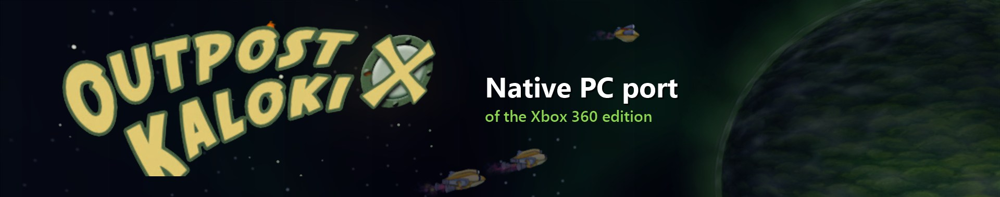

<br>

[](https://github.com/TekRantGaming/outpost-kaloki-x-recompiled/releases/latest)
[](https://github.com/TekRantGaming/outpost-kaloki-x-recompiled/releases)


### Outpost Kaloki X on PC, running natively, with the launcher and options of a modern PC release.

[](https://github.com/TekRantGaming/outpost-kaloki-x-recompiled/releases/latest)
&nbsp;


<sub>The original Xbox 360 game code, translated to native PC code with the <a href="https://github.com/rexglue/rexglue-sdk">ReXGlue SDK</a>. <b>No game files included</b>: bring your own copy of the Outpost Kaloki X Xbox Live Arcade package.</sub>

</div>

<br>

## Highlights

<table>
<tr>
<td width="33%" valign="top">

**Up to 8K**<br>
Render at up to 7680 x 4320, with presets from Supersample to Ultra Performance that match your screen.

</td>
<td width="33%" valign="top">

**60 fps and beyond**<br>
The Xbox 360 version ran at 30 fps. Pick 60, 120, 144, 165, 240 or unlimited, and the game still runs at its normal speed.

</td>
<td width="33%" valign="top">

**Xbox 360 style achievements**<br>
A pop-up with a sound every time you unlock one, just like the console. Choose the sound in the launcher.

</td>
</tr>
<tr>
<td valign="top">

**The full game, unlocked**<br>
Xbox Live Arcade games shipped as trials that you unlocked by buying them. That is no longer possible, so the full game is unlocked for you.

</td>
<td valign="top">

**Your controls, your way**<br>
Invert the camera, change its speed, set a deadzone, remap any button, adjust vibration, or play with keyboard and mouse.

</td>
<td valign="top">

**One-click builder**<br>
Double-click, pick your game file, and the builder makes the PC version for you. No technical steps.

</td>
</tr>
</table>

## Why this port? Isn't there already a PC version?

There is, but it is not this game. The original *Outpost Kaloki* came out on PC in 2004. A year later NinjaBee released **Outpost Kaloki X** on Xbox 360: a bigger, better version that the PC game never received.

| | PC *Outpost Kaloki* (2004) | Xbox 360 *Outpost Kaloki X* (2005) |
| --- | --- | --- |
| Levels | the original set | **more than twice as many** |
| Story campaigns | one | **two**: Adventure Story and War Story |
| Scenarios | fewer | **11**, including The Eight-Port Challenge, The Hammer and Survival |
| Challenges | none | **time challenges** with gold medal times |
| Graphics | original | **improved** |
| Achievements | none | **12** |
| Made for | mouse and keyboard | **a controller** |

Until now the only way to play it was on an Xbox 360 or an emulator. This port keeps it playable on modern PCs.

## The launcher

Everything is set up before the game starts. The launcher uses art from your own copy of the game: its icon, its achievement pictures and its title screen. Settings are saved to a plain text file, `outpost_kaloki_x.toml`, next to the game.

<table>
<tr>
<td width="55%">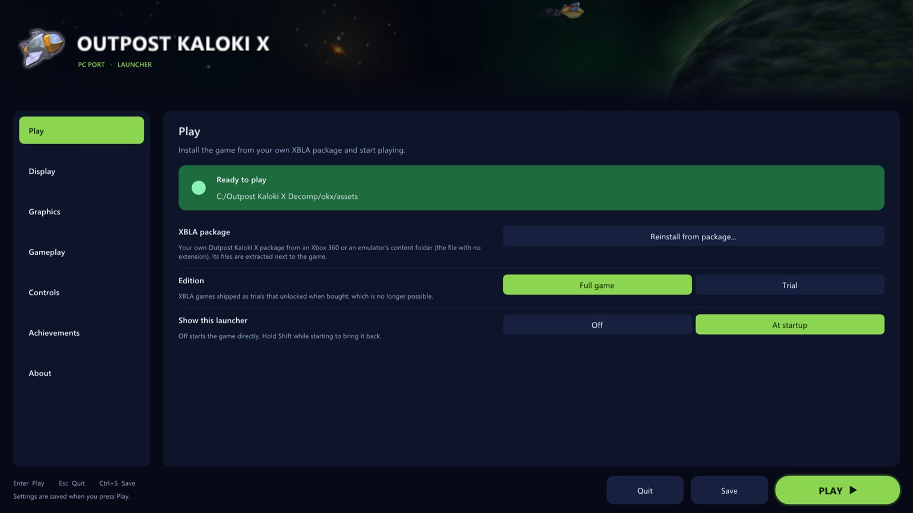</td>
<td valign="middle">

### Play
- **Install the game** straight from your Xbox Live Arcade package, with a progress bar
- Checks the file really is Outpost Kaloki X
- Play the **full game** or the **trial**
- Turn the launcher off and **hold Shift** at start to bring it back

</td>
</tr>
<tr>
<td valign="middle">

### Display
- **Windowed** or **fullscreen**
- **Window size** that fits your screen
- **Choose the monitor**
- **VSync** on or off (off works great with G-Sync and FreeSync)
- **Keep 16:9** with borders, or **stretch** to fill

</td>
<td width="55%">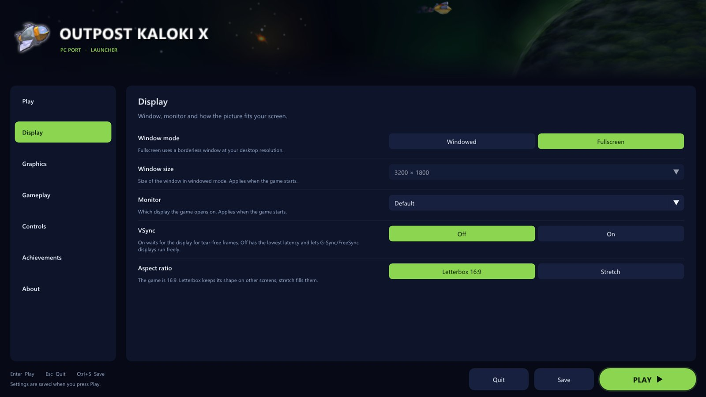</td>
</tr>
<tr>
<td>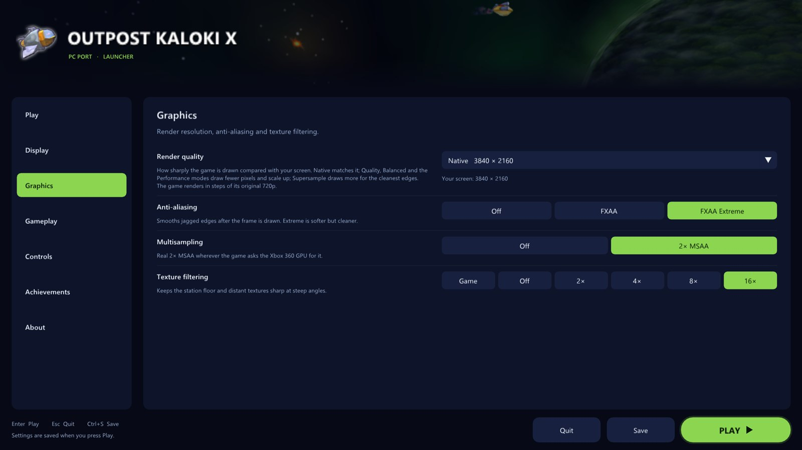</td>
<td valign="middle">

### Graphics
- **Render quality** presets: Supersample, Native, Quality, Balanced, Performance and Ultra Performance, each showing the real resolution for your screen
- **Custom resolution** from 1x (720p) to 6x (8K)
- **FXAA** and **FXAA Extreme**
- Real **2x MSAA**
- **Texture filtering** up to 16x

</td>
</tr>
<tr>
<td valign="middle">

### Gameplay
- **Frame rate**: 30, 60, 120, 144, 165, 240 or unlimited
- **Frame counter** in the corner, toggled with <kbd>F2</kbd>
- **Language**

</td>
<td>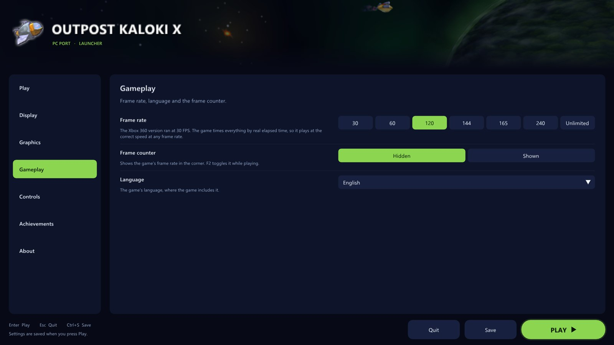</td>
</tr>
<tr>
<td>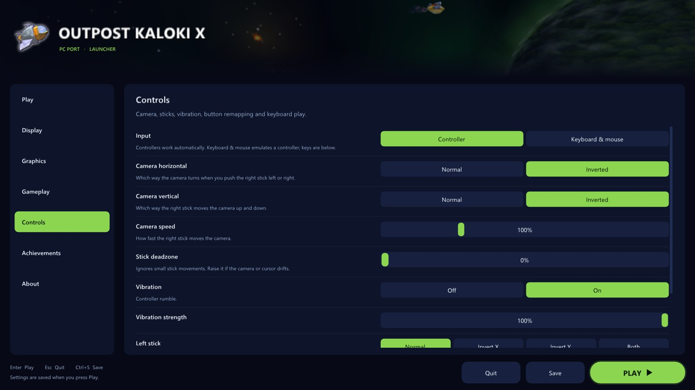</td>
<td valign="middle">

### Controls
- **Invert the camera** left/right and up/down, separately
- **Camera speed** from 25% to 300%
- **Stick deadzone** to stop drift
- **Vibration** on or off, with a strength slider
- **Remap any button** on your controller
- **Keyboard and mouse** play: click a control, press a key

</td>
</tr>
<tr>
<td valign="middle">

### Achievements
- All **12 achievements** with their pictures, descriptions and gamerscore
- See which ones you have **unlocked**
- Turn **pop-ups** and their **sound** on or off, set the volume
- **Pick the sound**: the built-in chime or any `.wav` you put in the `sounds` folder
- A **test button** to see and hear it
- A bonus **Welcome** achievement the first time you play

</td>
<td>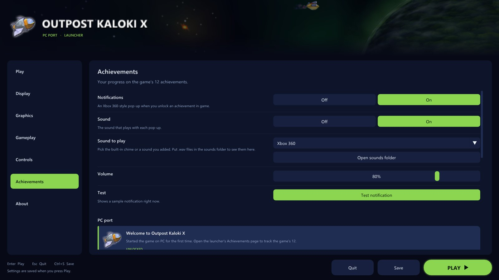</td>
</tr>
<tr>
<td>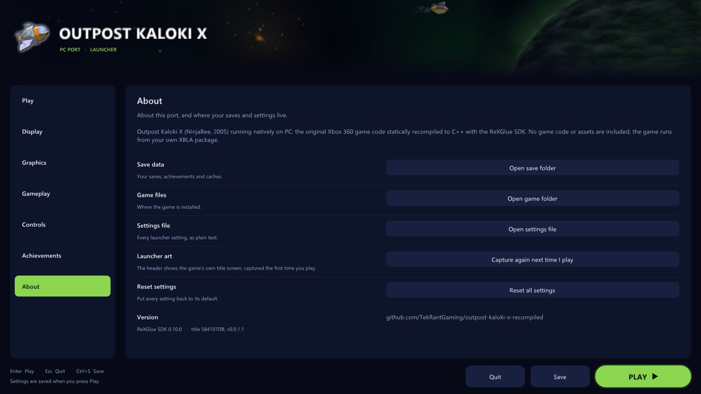</td>
<td valign="middle">

### About
- Open your **save folder**, **game folder** or **settings file** in one click
- **Reset** every setting
- Refresh the launcher's title screen art

</td>
</tr>
</table>

## In game

<div align="center">
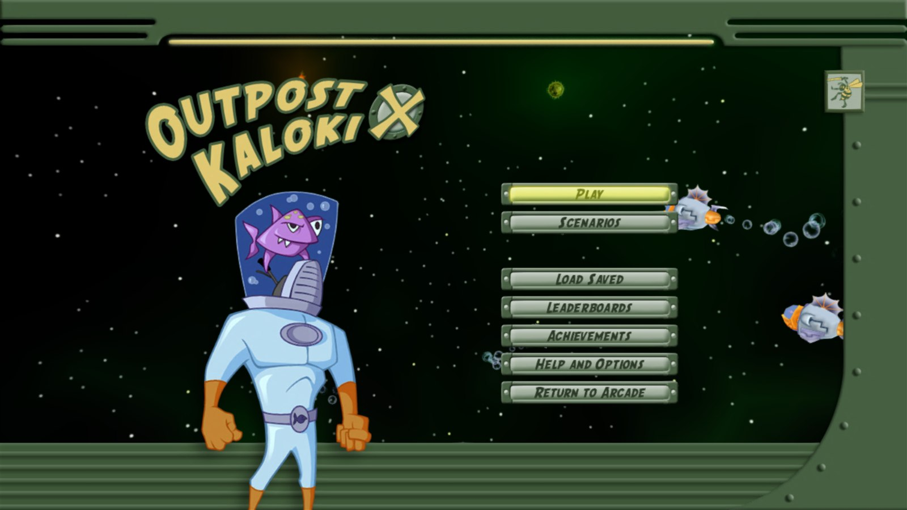
<sub>The main menu, rendered at 4K.</sub>
</div>

<br>

<table>
<tr>
<td width="50%">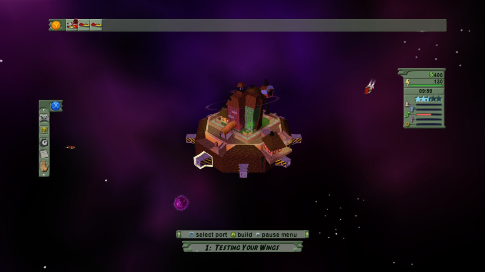</td>
<td width="50%">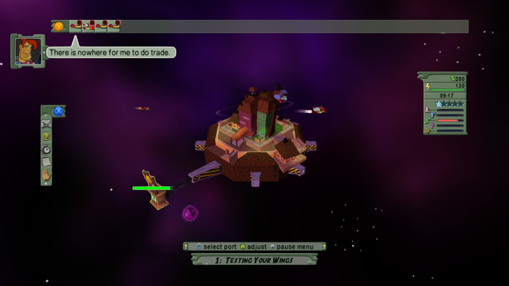</td>
</tr>
<tr>
<td>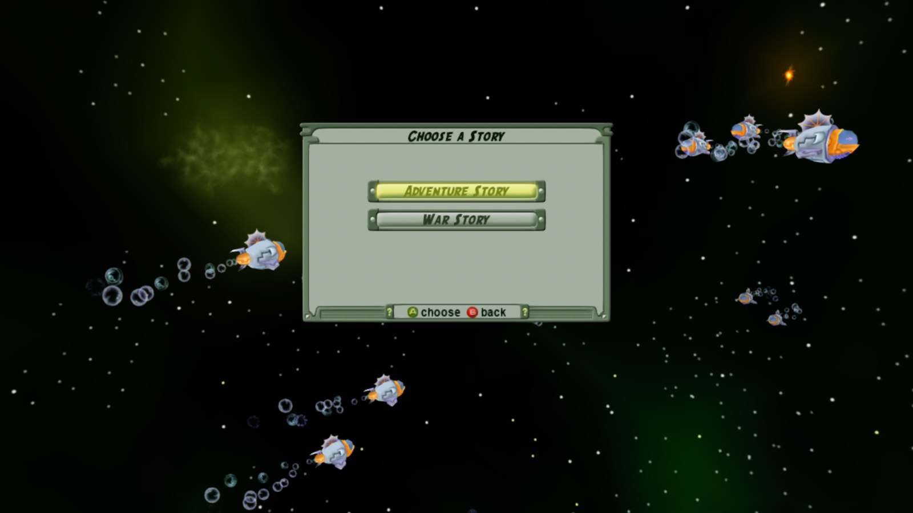</td>
<td>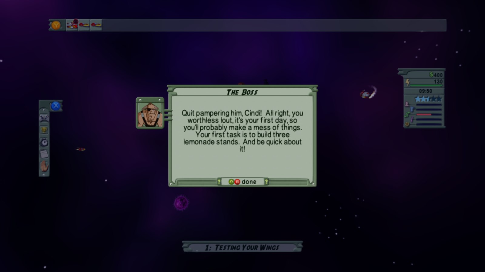</td>
</tr>
<tr>
<td>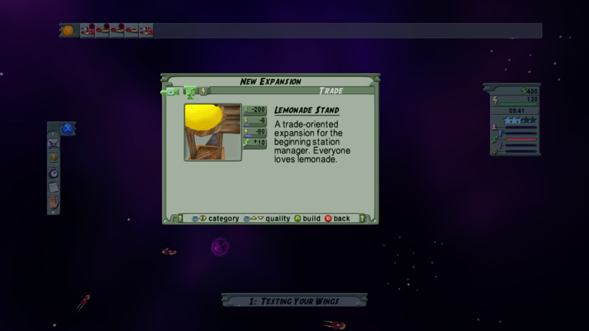</td>
<td>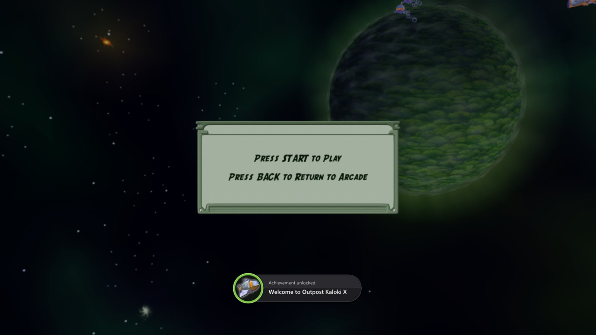</td>
</tr>
</table>

### Xbox 360 vs PC port

| | Xbox 360 | PC port |
| --- | :---: | :---: |
| Resolution | 1280 x 720 | up to 7680 x 4320 |
| Frame rate | 30 fps | 30 to 240 fps, or unlimited |
| Anti-aliasing | none | FXAA, 2x MSAA |
| Texture filtering | basic | up to 16x |
| Display | TV | windowed or fullscreen, any monitor |
| Controls | Xbox 360 controller | any controller, remapping, keyboard and mouse |
| Camera | fixed | inverted axes, speed, deadzone |
| Achievement pop-ups | console | Xbox 360 style, with your choice of sound |
| Full game | bought on Xbox Live | unlocked |

### Hotkeys

| Key | Action |
| --- | --- |
| <kbd>F2</kbd> | frame counter |
| <kbd>F3</kbd> | performance overlay |
| <kbd>F7</kbd> | achievements overlay |
| <kbd>Shift</kbd> while starting | open the launcher |

## Getting started

**You need:** Windows 10 or 11 (64-bit), a graphics card with DirectX 12, and your own Outpost Kaloki X Xbox Live Arcade package (the file with no extension from your Xbox 360 or emulator content folder, title ID `584107DB`).

1. Download the **Windows builder** from the [latest release](https://github.com/TekRantGaming/outpost-kaloki-x-recompiled/releases/latest) and unzip it.
2. Double-click **Build Outpost Kaloki X.bat**.
3. If it asks, let it install the build tools (Visual Studio Build Tools, CMake and Ninja). This is a one-time download of about 6 GB.
4. Pick your Outpost Kaloki X package when asked.
5. Wait while it builds (10 to 20 minutes). The finished game appears in the **OutpostKalokiX** folder, with an optional desktop shortcut.

**Why a builder and not a ready-made download?** The PC version is made from the game's own code, which belongs to its creators and can't be shared. The builder makes it on your PC from your own copy, so nothing from the game is ever downloaded or uploaded.

**Linux:** an AppImage is coming soon.

<details>
<summary><b>Building by hand (for developers)</b></summary>

```powershell
.\setup.ps1 -Package "C:\path\to\Outpost Kaloki X"   # downloads the SDK, unpacks your game, translates the code
okx\build.bat okx-release                             # compiles
```

The finished game is in `okx\out\build\okx-release`. Point it at your game files with `--game_data_root`, or copy them into a `game` folder next to the exe. Technical notes on every fix are in [NOTES.md](NOTES.md).

</details>

## Credits

- **Outpost Kaloki X** by NinjaBee (Wahoo Studios), published by Microsoft in 2005.
- [**ReXGlue SDK**](https://github.com/rexglue/rexglue-sdk), which does the code translation and runs the game, built on the work of [**Xenia**](https://github.com/xenia-project/xenia) and [**XenonRecomp**](https://github.com/hedge-dev/XenonRecomp).

> [!NOTE]
> **AI disclosure:** this port was made almost entirely with Claude Code (Anthropic). The repository owner directed and tested the work; the AI did the analysis, code, tools and documentation.

> [!IMPORTANT]
> This project is not affiliated with or endorsed by NinjaBee, Wahoo Studios, Microsoft or Xbox. It contains no game code or assets. Do not open issues asking for game files.
